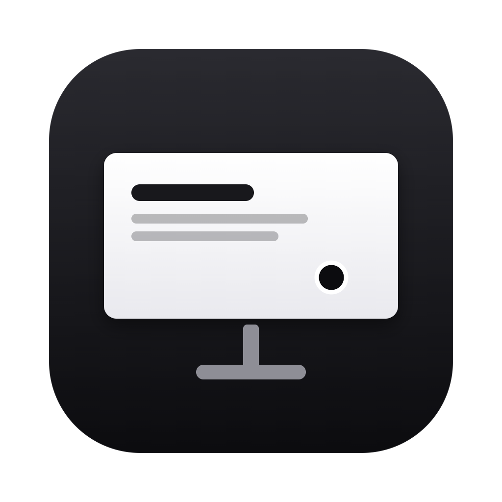
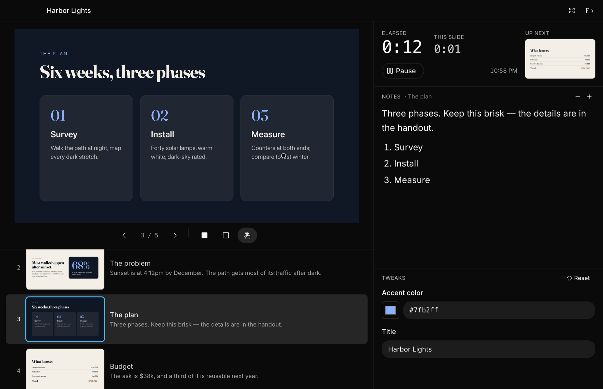
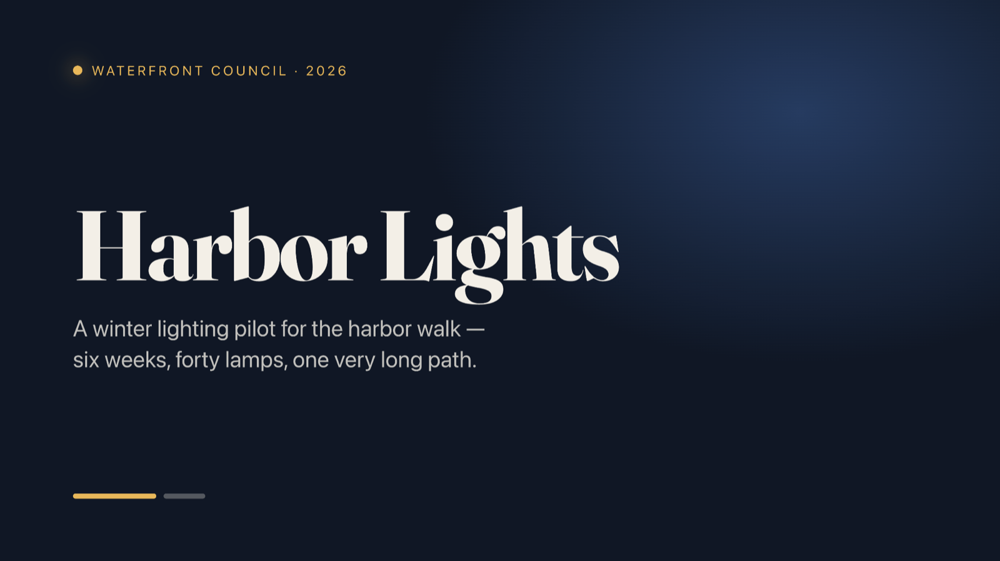
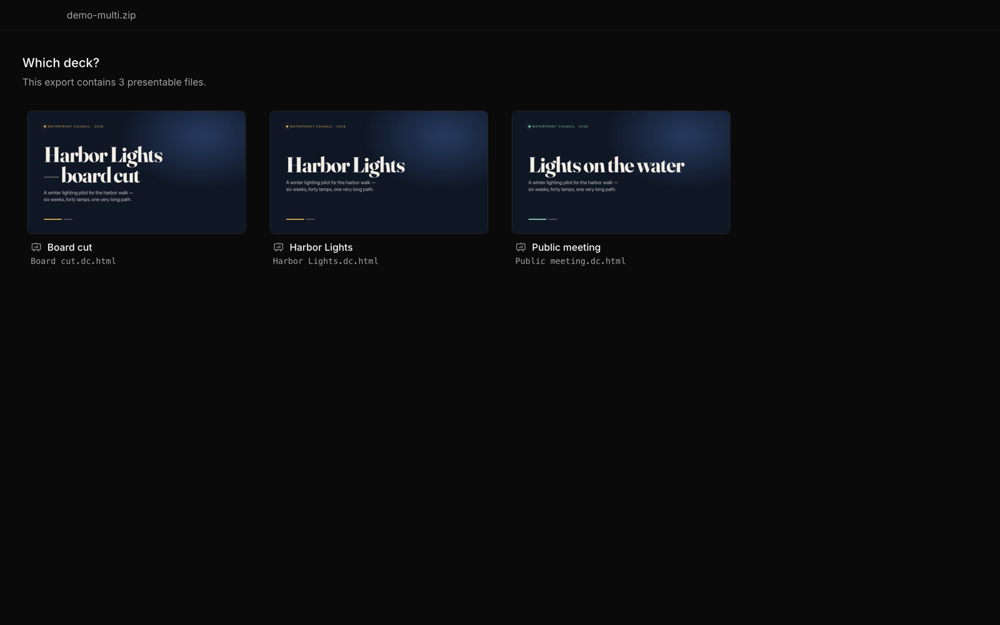

<p align="center">
  
</p>

<h1 align="center">Webdeck</h1>

<p align="center">
  Present <a href="https://claude.ai">Claude Design</a> slide decks (and PDFs) with a proper presenter view,<br>
  and nothing but the slide in front of your audience.
</p>

<p align="center">
  <a href="https://github.com/wgoodall01/webdeck/releases/latest/download/Webdeck-mac-arm64.dmg"><b>Download for macOS</b></a> (Apple silicon)
  &nbsp;·&nbsp;
  <a href="https://github.com/wgoodall01/webdeck/releases/latest/download/Webdeck-win-x64.msi"><b>Download for Windows</b></a> (x64)
  &nbsp;·&nbsp;
  <a href="https://github.com/wgoodall01/webdeck/releases/latest">All downloads</a>
</p>



## What it's for

Claude Design is a great way to make slide decks. Presenting them is harder:

- Presenting from the browser means **browser chrome and a `claude.ai` address bar** in the middle of
  your screen share.
- Exporting to PowerPoint or PDF is close, but not faithful. SVGs, clipping masks, animations and
  interactive slides can all come out different, so you'd have to check every slide first.
- Browser presenter views are thin next to PowerPoint's: timers, the next slide, a slide list you
  can jump around in, black screen, and clicking into the live slide.

Webdeck opens the `.zip` you export from Claude Design and renders the deck **exactly as Claude Design
does** (it runs the same HTML), in two windows:

- **The audience window** holds the slide and nothing else. It has no frame, no toolbar and no URL,
  and it stays locked to the deck's aspect ratio. Share that window on a call, or fullscreen it on
  the projector.
- **The presenter window** is for you. It has a live preview you can click into, every slide at a
  glance, timers, what's up next, your speaker notes, and the deck's **Tweaks** as knobs you can
  turn mid-talk, without them ever showing on a slide.

It opens PDFs too (e.g. from Beamer or Keynote), with the same presenter view.

## Download and install

| Platform              | Installer                                                                                                                             | Also available                                                                                                                    |
| --------------------- | ------------------------------------------------------------------------------------------------------------------------------------- | --------------------------------------------------------------------------------------------------------------------------------- |
| macOS (Apple silicon) | [`Webdeck-mac-arm64.dmg`](https://github.com/wgoodall01/webdeck/releases/latest/download/Webdeck-mac-arm64.dmg): drag to Applications | [`.app` as a zip](https://github.com/wgoodall01/webdeck/releases/latest/download/Webdeck-mac-arm64.zip)                           |
| Windows (x64)         | [`Webdeck-win-x64.msi`](https://github.com/wgoodall01/webdeck/releases/latest/download/Webdeck-win-x64.msi)                           | [Portable `.exe`](https://github.com/wgoodall01/webdeck/releases/latest/download/Webdeck-win-x64-portable.exe), no install needed |

On macOS, the quickest install skips the Gatekeeper prompt entirely:

```sh
curl -fsSL https://raw.githubusercontent.com/wgoodall01/webdeck/main/scripts/install.sh | sh
```

Or with Homebrew (this repo is also a tap):

```sh
brew tap wgoodall01/webdeck https://github.com/wgoodall01/webdeck
brew install --cask wgoodall01/webdeck/webdeck
```

Upgrade with `brew upgrade webdeck`, or by re-running the install script.

The builds aren't notarized (macOS) or code-signed (Windows), so if you install from the
`.dmg`/`.zip` or `.msi`/`.exe` downloaded in a browser, the first launch needs one extra step:

- **macOS:** run `xattr -dr com.apple.quarantine /Applications/Webdeck.app` once. Or open Webdeck,
  dismiss the warning, then go to **System Settings → Privacy & Security** and click **Open Anyway**
  (on macOS 14 and earlier, right-click the app → **Open** also works).
- **Windows:** if SmartScreen appears, click **More info → Run anyway**.

## Using it

1. In Claude Design, export your deck as a `.zip`.
2. Launch Webdeck. It asks for a file: pick the `.zip` (or a `.pdf`). If the export contains several
   decks, you choose one from rendered previews.
3. The audience window and the presenter window both open. Put the audience window where the audience
   is: share it on the call, or drag it to the projector and press **F**.

<p align="center">
  
  
</p>

**The audience window** moves when you drag anywhere on it, like a QuickTime video, and a plain click
still reaches the slide. Double-click (or **F**) toggles fullscreen. On macOS the window buttons appear
only while your mouse is over it, and in fullscreen the title bar slides down from the top edge as
usual.

**The presenter window**:

- **Live preview.** Exactly what the audience sees, down to the pixel. Click, scroll, and type into it
  to use interactive slides (**Esc** hands the keyboard back).
- **Pointer.** With the pointer on (the hand button, or **L**), wherever you hover on the preview
  shows up as a dot on the audience's screen.
- **Slide list.** Every slide with its title and first line of notes. It follows along as you
  present, but you can scroll freely and click any slide to jump there.
- **Timers.** Total and per-slide, plus the time of day. Click a timer to reset it.
- **Notes** are shown as Markdown, with adjustable text size.
- **Tweaks.** If the deck has Tweaks (colours, toggles, copy variants), they appear as controls and
  apply live.

### Keyboard

Navigation, black/white screen and fullscreen work in either window, so presentation clickers
(which send PgUp/PgDn) work wherever focus is. Jumping by number and the pointer toggle are in the
presenter window.

| Keys                                     | Does                           |
| ---------------------------------------- | ------------------------------ |
| **→** **↓** **Space** **PgDn** **Enter** | Next slide                     |
| **←** **↑** **Shift+Space** **PgUp**     | Previous slide                 |
| **Home** / **End**                       | First / last slide             |
| type a number, then **Enter**            | Jump to that slide             |
| **B** or **.**                           | Black screen (again to return) |
| **W** or **,**                           | White screen                   |
| **L**                                    | Toggle the pointer             |
| **F**                                    | Toggle audience fullscreen     |
| **⌘O** / **Ctrl+O**                      | Open another deck              |

Webdeck is stateless: nothing is saved between launches, and quitting (closing the presenter
window) ends everything.

---

## Technical notes

### How it works

```
                ┌──────────── main process ─────────────┐
 deck.zip ─────▶│ DeckFiles (yauzl, lazy, no extraction) │
                │   └─ deck://<mount>/…  protocol        │
                │                                         │
                │ LiveStage ── StageHost (offscreen,      │   GPU shared texture
                │   │           isolated, sandboxed) ─────┼──┬──▶ audience window  (canvas)
                │   │  paint → importSharedTexture        │  └──▶ presenter preview (canvas)
                │   └─ FrameFanout (ref-counted, latest-  │        same pixels, zero copies
                │       frame replay, per-sink backpress.)│
                │ SlideThumbnailer ── StageHost (CPU,     │──▶ slide list / up next (JPEG)
                │                     animations frozen)  │
                │ PresentationSession · AppController     │◀─▶ typed IPC (src/shared/ipc.ts)
                └─────────────────────────────────────────┘
```

The deck runs in **one isolated, sandboxed, offscreen web context** (Electron offscreen rendering).
Each frame it paints is a GPU texture, which is imported with Electron's `sharedTexture` API and sent
to both the audience window and the presenter preview as a `VideoFrame`. So the preview is the
audience's frame itself, not a second copy of the deck that could drift out of sync.

**Layers.** Each layer talks only to the one below it, through a small typed interface:

| Layer                       | Where                                      | Knows about                                                                   |
| --------------------------- | ------------------------------------------ | ----------------------------------------------------------------------------- |
| Shared model and pure logic | `src/shared/`                              | Decks, tweaks, input, the IPC and stage protocols. No Electron. Unit-tested.  |
| Deck sources                | `src/main/deck/`, `src/main/protocol/`     | Archives and files → `deck://` URLs                                           |
| Stage                       | `src/main/stage/`                          | One offscreen web context: load, drive, input, frames. Nothing about windows. |
| Session / controller        | `src/main/session.ts`, `app-controller.ts` | Glue: stage ↔ windows ↔ state                                                 |
| Driver (in the slide page)  | `src/preload/stage*.ts`                    | Adapts `<deck-stage>` (or a plain page) to the stage protocol                 |
| UI                          | `src/renderer/`                            | TanStack Start (SPA mode) + shadcn/ui. Renders state; sends commands.         |

Design choices worth knowing:

- **The slide page owns the truth.** The host sends commands (`goTo`, `step`, `setTweaks`), and the
  driver reports what actually happened. A link or script inside the deck that navigates keeps
  everything in sync.
- **Frames.** Offscreen rendering only paints when something changes, so the fanout keeps the
  latest frame and replays it to any window that attaches or resizes. Each window holds at most one
  pending frame (newer frames replace it), so a slow window drops frames rather than exhausting
  Chromium's small texture pool. If the GPU path is unavailable, it falls back to CPU JPEG frames.
- **Double-buffered reloads.** Anything that needs a reload (a resolution change, an EDITMODE tweak)
  loads a second stage off to the side, waits for it to settle, then swaps atomically, so the
  audience never sees a blank frame.
- **Resolution.** The stage lays out at the deck's design size (1920×1080 for Claude Design) with a
  device scale factor chosen for the largest attached display, so text stays sharp on 4K.
- **Stateless.** Decks are served straight out of the `.zip` through a custom `deck://` protocol
  (with Range support for media). Nothing is extracted or cached to disk, and each deck runs in an
  in-memory session.

### What's inside a Claude Design export

This is what the driver relies on, from reverse-engineering real exports:

- **Structure.** `<Name>.dc.html` is a _Design Component_ page. `support.js` is the `x-dc` runtime,
  which loads React 18 UMD from unpkg and renders the `<x-dc>` template. `deck-stage.js` defines
  `<deck-stage>`; `_ds/` holds the design system; `assets/` and `uploads/` hold media. `.thumbnail`
  is a WebP of the project.
- **Pagination.** `<deck-stage width height>` holds one `<section>` per slide. All slides stay mounted,
  and the inactive ones are hidden. The active slide gets `[data-deck-active]`. It has a public API
  (`goTo`, `next`, `prev`, `index`, `length`, `designWidth`/`designHeight`) and fires a `slidechange`
  event. `#N` in the URL restores slide N on load. `data-deck-skip` marks skipped slides. The
  `__omelette_presenting` message and the `no-rail` attribute hide its editor chrome; the driver also
  removes the nav overlay and the slide-edge ring from its shadow root.
- **Notes.** Stored per slide in `data-speaker-notes`, falling back to a
  `<script id="speaker-notes">` JSON array.
- **Animations.** There are no slide transitions: switching slides is instant. Entrance animations
  are CSS gated on `[data-deck-active]`, so they replay each time a slide is entered. Thumbnails
  freeze all animations and transitions at their end state.
- **Tweaks.** In `.dc.html` they're root-component props, declared as JSON in
  `<script data-dc-script data-props='{"key":{"default":…}}'>`. The runtime exposes them as
  `__dcRegistry[root].propsMeta` and applies them live via `window.__dcSetProps(root, values)`, which
  is how Webdeck drives them. Older HTML decks keep a `/*EDITMODE-BEGIN*/{…}/*EDITMODE-END*/` block of
  defaults and have no live setter. Webdeck rewrites that block as the file is served and reloads the
  stage (double-buffered). The deck's own Tweaks panel is never activated, so it never appears on a
  slide.

### PDFs

PDFs render in Chromium's built-in viewer inside the same offscreen stage. The viewer lives in a
cross-origin extension frame, so main drives it directly (`src/main/stage/pdf-viewer-driver.ts`):
it zooms so a page exactly fills the viewport, navigates with `viewport_.goToPage`, and hides
scrollbars. That's the viewer's internal API, not a public one. It's verified against the Chromium
in Electron 44, so recheck it when upgrading Electron. PDFs have no speaker notes.

### Limitations

- Claude Design decks load React and web fonts from CDNs at runtime, so presenting needs a network
  connection.
- Builds are ad-hoc signed (macOS) and unsigned (Windows); see
  [Releases](#releases) for signing.

### Development

Requires Node 26 and pnpm 11 (the exact versions are pinned in `.node-version` and
`packageManager`).

```sh
pnpm install
pnpm dev                 # electron-vite + TanStack Start dev server; opens the Open dialog
pnpm check               # typecheck, oxlint, oxfmt --check, vitest
pnpm dist:mac            # arm64 .dmg + zipped .app → dist/
pnpm dist:win            # x64 .msi + portable .exe → dist/ (on Windows)
pnpm dist:win:zip        # x64 zip, cross-builds from any OS
pnpm smoke deck.zip      # end-to-end run on the real GPU path; screenshots → out/smoke/
```

Toolchain: Electron 44, electron-vite, TanStack Start (SPA mode), React 19, shadcn/ui (Base UI),
Tailwind 4, TypeScript 7, oxlint, oxfmt, vitest, electron-builder.

The smoke test (`src/main/smoke.ts`) is the one to run after touching rendering. It launches the
real app on a deck, screenshots every window, steps through slides, checks that each surface stays
lit across open and resize, and quits.

### Releases

- **CI** (`.github/workflows/ci.yml`) runs on every PR and push to `main`: typecheck, oxlint,
  oxfmt, vitest, and a full build.
- **Release** (`.github/workflows/release.yml`) runs when you push a `v*` tag. Cut one from a clean
  `main` with:

  ```sh
  pnpm release v0.2.0                     # bumps the cask, commits "Release 0.2.0", tags v0.2.0
  git push --atomic origin main v0.2.0    # it prints this; pushing the tag starts the build
  ```

  It builds on native runners (macOS arm64, Windows x64) and publishes a GitHub release with the
  `.dmg`, the zipped `.app`, the `.msi`, and the portable `.exe`. File names don't include the version,
  so the `releases/latest/download/…` links above always point at the newest build. The version
  comes from the tag (`package.json` needn't be bumped), and suffixed tags like `v0.2.0-beta.1`
  publish as prereleases. You can also re-run it for an existing tag from the Actions tab.

- **Signing.** macOS builds are ad-hoc signed with the entitlements Electron needs under the hardened
  runtime. To sign with a Developer ID, add `CSC_LINK`/`CSC_KEY_PASSWORD` repo secrets, set
  `mac.identity` in `electron-builder.yml`, and add notarization.

- **Install paths.** `scripts/install.sh` and the Homebrew cask (`Casks/webdeck.rb`) both fetch the
  zipped `.app`. The script always takes `releases/latest/download/`; the cask pins the release's
  version, which `pnpm release` bumps, and skips the checksum since the zip is built after the tag.
  Until CI finishes, `brew upgrade` for the new version 404s. The script avoids Gatekeeper because
  curl doesn't quarantine what it downloads; the cask removes Homebrew's quarantine flag in a
  `postflight`.

### Packaging notes

- `pnpm build` runs `electron-vite build` (main, preloads) and then
  `vite build -c vite.renderer.config.ts`. electron-vite's build runs only a single Vite environment,
  but TanStack Start needs its multi-environment `buildApp` (client plus a prerendered SPA shell).
- Sandboxed preloads must be single-file CJS, so `electron` is marked external. Otherwise the bundler
  inlines the npm stub, which just returns a path.
- The Windows `.msi` and portable `.exe` need WiX and NSIS, so they're built on Windows.
- The app icon's source is `build/icon.svg`. Re-render it with
  `pnpm exec electron scripts/render-icon.cjs`.
